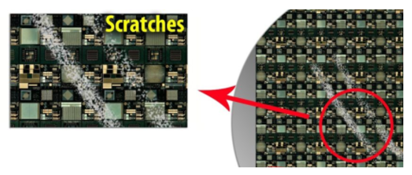

# Scratch Detection Project

## Introduction

In the semiconductor industry, **wafers** are thin discs of semiconductor material (e.g., silicon) used to fabricate microelectronic devices such as transistors and integrated circuits. A single wafer can contain hundreds or thousands of individual devices, known as **dies**, which are typically cut or "diced" from the wafer after manufacturing completes.


One major challenge in wafer production is identifying and isolating defects, including scratches, which can compromise device performance and reliability. Scratches appear as elongated clusters of faulty dies with a high length-to-width ratio. They may result from equipment misalignment or handling errors and can contain latent defects affecting device quality.

Within scratch regions, some dies may still pass electrical tests ("Ink"), but are physically compromised and require manual marking and removal to prevent future failures.

## Data Description

You will receive wafer maps for a specific operation. Each row in the dataset corresponds to an individual die and includes the following columns:

| Column       | Description                                                             |
| ------------ | ----------------------------------------------------------------------- |
| WaferName    | Unique identifier for the wafer                                         |
| DieX         | Horizontal coordinate of the die on the wafer                           |
| DieY         | Vertical coordinate of the die on the wafer                             |
| IsGoodDie    | Binary flag indicating if the die passed testing                        |
| IsScratchDie | Binary flag indicating if the die belongs to a scratch (Scratch or Ink) |

## Visual Examples

* **Optical scratch view**

  

* **Logical wafer map**

  

* **Scratch detection marks**

  

## Business Goals

1. **Automation**: Replace the current manual, time-consuming ink-marking process with an automated model to reduce costs and errors.
2. **Quality**: Balance yield and quality by minimizing missed scratches while avoiding excessive ink marking of good dies.
3. **Wafer-Level Classification**: Provide a secondary binary output indicating whether a wafer contains any scratches, which is useful for returning scratched wafers before in-depth inspection.

*Note*: For wafers with unusually low yield (many faulty dies), scratch detection is disabled to prevent misclassifying random fault clusters as scratches.

## Assignment Requirements

1. **Exploratory Data Analysis**: Examine spatial patterns of Scratches and Ink, analyze yield distribution.
2. **Model Selection**: Choose and justify appropriate machine learning algorithms (e.g., spatial clustering, convolutional approaches, tree-based models).
3. **Evaluation Metrics**: Select metrics (e.g., precision, recall, F1-score) aligned with business goals.
4. **Implementation**: Train models on provided training data and predict `IsScratchDie` for the test set.
5. **Output**: Submit a CSV file with predictions (`WaferName, DieX, DieY, PredictedIsScratchDie`).
6. **Documentation**: Include a Jupyter notebook detailing your analysis, experiments, and final model.

## Getting Started

1. Clone this repository:

   ```bash
   git clone <repository_url>
   ```
2. Install dependencies:

   ```bash
   pip install -r requirements.txt
   ```
3. Open the notebook and run all cells to reproduce analysis and results:

   ```bash
   jupyter notebook ScratchDetection.ipynb
   ```
4. Review your predictions in `predictions.csv`.

---

*For more information on semiconductor failures, see [Why Chips Die](https://semiengineering.com/why-chips-die/) and the [Introduction to Semiconductors](https://web.archive.org/web/20230115132446/https://www.amd.com/en/technologies/introduction-to-semiconductors/).*
